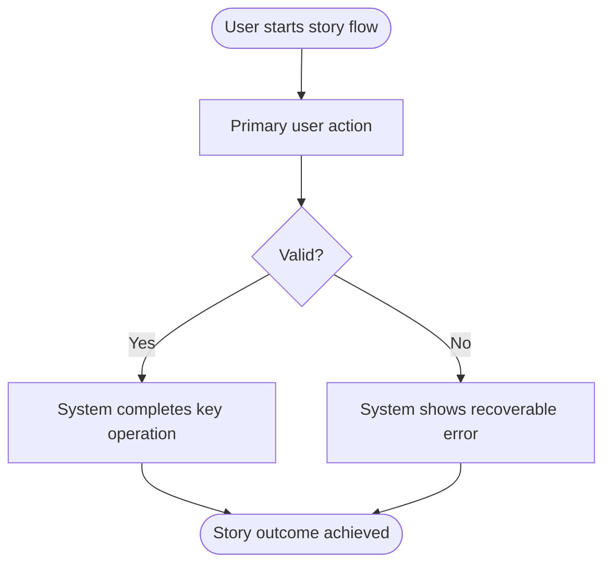
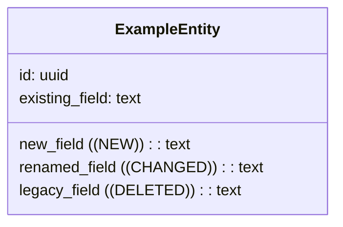
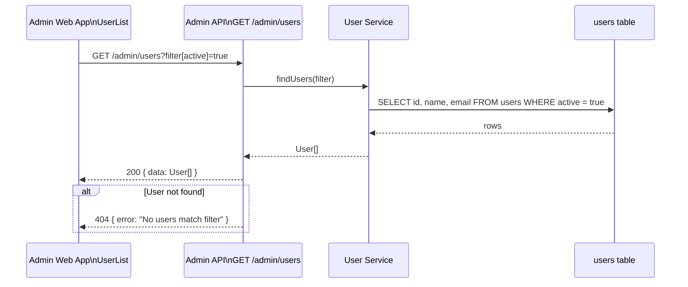

# Story Breakdown

### Pipeline I/O

| Direction | File | Description |
| --------- | ---- | ----------- |
| **In** | `./planning/<epic-slug>/epic.md` | User stories, story-level context and dependencies, and epic-level UI references from `/a-epic` |
| **In/Out** | `./planning/<epic-slug>/architecture.md` | Epic-specific architecture from `/a-architecture`; update when the approved story acceptance criteria or deeper investigation reveal durable epic-level technical detail later stories should inherit |
| **In** | `./planning/<epic-slug>/personas.md` | Personas from `/a-epic` |
| **In/Out** | `./planning/glossary.md` | Shared domain glossary from `/a-global-architecture` |
| **In/Out** | `./planning/global-architecture.md` | Shared repo-wide architecture from `/a-global-architecture` |
| **Out** | `./planning/<epic-slug>/story-<story-number>.md` | Detailed story breakdown for this story, including story-level completion status, numbered acceptance criteria, story-relevant UI references, and the execution process that `/a-criterion` reads and updates |

## Skills

Invoke these skills when relevant:
- `ux-laws` for stories with UI
- `react-best-practices` when the project uses React
- All relevant project specific rules and skills

## Purpose

Break one story into a concrete, code-informed execution process without writing code. This command should:
- investigate the current codebase
- draft and refine acceptance criteria with the user before locking them into the story artifact
- define reuse opportunities and constraints
- refine story-level details when needed
- reconcile `architecture.md` when the approved acceptance criteria or story-level findings reveal durable epic-specific architecture detail
- capture schema-impact context when the story changes persisted schema
- produce a single story artifact with numbered acceptance criteria and execution tasks for `/a-criterion`

## Rules

- NEVER write or modify application code, create commits, or write files outside `./planning/`
- NEVER skip codebase investigation; story work must be grounded in the real codebase
- NEVER define synonyms; if a term exists in the glossary, use its canonical name
- NEVER abbreviate new names
- NEVER propose extractions for hypothetical future use
- NEVER write unnumbered acceptance criteria; `/a-criterion` depends on stable criterion numbers
- NEVER finalize the acceptance-criteria list without explicit user approval for each criterion in order
- NEVER let implementation tasks float without a clear acceptance-criterion parent
- NEVER split implementation tasks by technology layer alone when one coherent story-slice task would be clearer
- refine higher-level artifacts only when the finding is durable and useful beyond this one local note
- reconcile `architecture.md` after the acceptance criteria are locked and story investigation is complete when the story reveals epic-specific technical truth other stories should inherit
## Step 1: Resolve required inputs

`$ARGUMENTS` = `<story-number> [instructions-or-suggestions]`

One required numeric argument. Remaining text is optional high-priority guidance. Does not accept an epic slug.

Resolve `<epic-slug>` from `./planning/current.json`. Stop if missing or malformed.

Read (stop if any are missing):
- `./planning/<epic-slug>/epic.md`
- `./planning/<epic-slug>/architecture.md`
- `./planning/<epic-slug>/personas.md`
- `./planning/glossary.md`
- `./planning/global-architecture.md`

Follow all references from planning artifacts. Stop and report any unreadable reference.

When `epic.md` contains a `UI References` section, treat those references as required input. Read and follow them before working on any story with UI.

Extract the requested story section from `epic.md`. The story context includes:
- title
- canonical story statement
- user context
- acceptance criteria
- dependencies

Also extract the epic-level sections from `epic.md` that apply across stories:
- draft ERD
- requirements
- UX considerations
- UI references
- references

Output:
```text
Story: <title>
Epic: <epic name>
Architecture: loaded
Personas: loaded
Epic-level context: loaded
Has UI: <yes | no>
UI references: <list or none>
```

## Step 2: Draft acceptance criteria with the user

Use the selected story's canonical statement from `epic.md`, its user context, dependencies, personas, and any trailing guidance to propose the story's working acceptance criteria list.

Draft them interactively:
1. propose exactly one numbered acceptance criterion at a time, starting with `1`
2. ask the user to approve or revise that specific criterion before proposing the next one
3. if the user revises a criterion, fold the revision into the wording and confirm it before continuing
4. do not draft criterion `N + 1` until criterion `N` is explicitly approved
5. keep the numbering stable once a criterion is approved; if a later change forces renumbering, stop and get explicit user confirmation for the renumbered list

While drafting:
- split overly broad source criteria into multiple numbered criteria when that improves implementation clarity
- merge duplicate or overlapping source criteria when the user agrees
- keep criteria implementation-relevant and testable, but do not turn them into tasks
- preserve glossary-canonical naming

After the last criterion is approved, restate the full numbered list and treat it as the locked acceptance-criteria source for the rest of the command.

Immediately compare the locked list against `architecture.md` and note any epic-level technical detail that now needs confirmation, correction, or expansion during investigation.

## Step 3: Investigate the codebase

Use `global-architecture.md` and `architecture.md` to scope targeted code exploration to achieve the story acceptance criteria.

The four axes below are **independent** — dispatch them in parallel via `superpowers:dispatching-parallel-agents` (one agent per axis, all in a single message). Don't run them sequentially.

1. related existing code
2. patterns and conventions
3. reuse opportunities
4. epic-specific architecture details that should be added back to `architecture.md` once this story is better understood

Each investigation result should report:
- relevant files
- why they matter
- patterns to follow
- reusable components, services, types, or utilities
- naming matches or conflicts with the glossary

If the story affects persisted schema, also identify:
- affected entities or tables
- relationships relevant to the story
- fields that are new, changed, or deleted
- unchanged fields that are still relevant to the story's implementation or review

Display the findings before proceeding.

## Step 4: Check consistency

Based on the investigation, evaluate:
1. naming conventions
2. file placement conventions
3. API and service patterns
4. component patterns
5. test patterns
6. type and contract patterns

Flag inconsistencies that matter to this story. Do not fix unrelated issues.

## Step 5: Define UX

If the story has UI, use `ux-laws` and define:
- user flow
- states
- feedback
- accessibility requirements

Use the followed UI references to ground those decisions. Do not invent UI behavior that contradicts the referenced design artifacts unless the conflict is surfaced explicitly.

If there is no UI, explicitly note that UX/UI sections are skipped.

## Step 6: Define UI

If the story has UI, define:
- component inventory
- hierarchy
- important props and state boundaries
- styling approach
- responsive behavior

If there is no UI, explicitly note that UI sections are skipped.

## Step 7: Define opportunities for code extraction and reusability

Identify justified extractions:
- shared components
- shared utilities
- shared types
- necessary refactors

Only include extractions that are clearly warranted by this story.

## Step 8: Refine upstream artifacts when needed

_With user permission_, this command may update higher-level artifacts when deeper investigation uncovers durable knowledge:
- update `epic.md` when the story wording, boundaries, sequencing, or dependencies need correction
- update `architecture.md` when the locked acceptance criteria or story work reveal epic-specific technical details other stories should inherit, especially newly clarified entities, interfaces, flows, sequencing, or constraints
- update `glossary.md` when durable domain names, code names, sources, or statuses are confirmed
- update `global-architecture.md` only when the work reveals durable cross-epic structure

When `architecture.md` needs refinement:
- update it before or alongside writing `story-<story-number>.md`, not as an afterthought
- keep the architecture artifact focused on epic-level technical truth other stories should inherit
- leave story-local execution detail in `story-<story-number>.md`

Summarize every such update in the output.

## Step 9: Write `story-<story-number>.md`

Write `./planning/<epic-slug>/story-<story-number>.md` with this structure:

This file is the single source of truth for the story. It captures story context, codebase findings, UX, UI, references, the required story diagrams, justified extractions, a story-level completion marker, the user-approved numbered acceptance criteria, and the execution process that `/a-criterion` reads and updates.

```md
# Story <story-number>: <title>

> Epic: <epic name>
> Generated: <date>
> Source Story: `./planning/<epic-slug>/epic.md`

> _As a_ [role]
> _I want_ [action]
> _So that_ [benefit]

## Status
- [ ] Story complete

## User Context
- ...

## Acceptance Criteria
1. [ ] ...
2. [ ] ...

## UX Definition
### User Flow
1. ...

### States
| State | Description | UI Behavior |
| ----- | ----------- | ----------- |

### Accessibility
- ...

## UI Definition
### Component Inventory
| Component | New/Existing | Location |
| --------- | ------------ | -------- |

### Component Hierarchy
- ...

### ASCII UI Sketch
- If the story has UI, include a compact ASCII drawing that shows the primary layout, key controls, important content regions, and main interaction affordances
- Keep it implementation-oriented and readable in plain text; use labels that match the story terminology and followed UI references
- If the story does not have UI, write `- None`

```text
+--------------------------------------------------+
| Story Screen Title                               |
+--------------------------------------------------+
| Filter / Search: [______________]   [Action Btn] |
+--------------------------+-----------------------+
| Navigation / List        | Primary Content Area  |
| - Item A                 | - Key field           |
| - Item B                 | - Status              |
| - Item C                 | - Secondary actions   |
+--------------------------+-----------------------+
| Feedback / validation / empty-state messaging    |
+--------------------------------------------------+
```

## UI References
- Story-relevant subset of the epic-level UI references, plus any story-local UI references followed during this run
- If none exist, write `- None`

## Diagrams
Present these diagrams in this exact order:
1. Flow Diagram
2. Class Diagram
3. Sequence Diagram

### Flow Diagram
- Include a Mermaid `flowchart` that shows the story's end-to-end user and system flow
- Show the main happy path plus key decision branches, failures, and handoffs that matter to implementation review
- Keep it scoped to this story only



### Class Diagram
- Include a Mermaid `classDiagram` that shows only the story-relevant entities, tables, value objects, or components and their relationships
- Show each entity once using its DB representation only; do not duplicate the same entity across tech stacks (e.g., do not show both a DB table and a TS interface for the same concept)
- Use `((NEW))`, `((CHANGED))`, and `((DELETED))` only for actual persisted schema changes
- Include unchanged fields only when they are relevant for understanding the story
- If the story does not change persisted schema, still include the story-relevant domain or structural relationships rather than writing `None`



### Sequence Diagram
- Include a Mermaid `sequenceDiagram` that shows the story's runtime interactions across tech layers
- Participants must make the main runtime and deployment boundaries obvious first: monorepo apps, API surfaces, workers, Lambdas, queues, databases, AWS services, and third-party systems
- When helpful, annotate a participant with the concrete code entrypoint behind that boundary, but do not let the diagram collapse into an internal function-call trace
- Group participants by tech boundary so the handoffs are visually obvious (e.g., Web App | API | Lambda | Queue | AWS | Third Party | DB)
- Arrow labels must describe the boundary-crossing contract or call, such as an HTTP route, webhook, queue publish/consume, event, SDK call, or SQL operation
- Show the happy path first, then key alt/opt blocks for errors or edge cases
- Keep it scoped to this story only



## Codebase Context
### Related Code
- ...

### Patterns To Follow
- ...

### Reuse Opportunities
- ...

## Consistency Notes
- ...

### Extractions
| What | From/Why | Target Location | Blocks Story? |
| ---- | -------- | --------------- | ------------- |

## Execution Process
### Acceptance Criterion 1

> _Given_ [precondition]
> _When_ [action]
> _Then_ [expected result]

#### Outcome
- Describe what must be true when this criterion is complete

#### Files Likely To Change
- `path/a`

#### Dependencies
- none

#### Implementation Tasks
- [ ] Task 1.1: <imperative title>
  **Type**: [component | hook | service | api | model | migration | test | config | refactor]
  **Files**: `path/a`, `path/b`
  **Description**: ...
  **Notes**: ...

### Acceptance Criterion 2

> _Given_ ...
> _When_ ...
> _Then_ ...

#### Outcome
- ...

#### Files Likely To Change
- ...

#### Dependencies
- `1` | `Story <other-story-number>` | none

#### Implementation Tasks
- [ ] Task 2.1: ...

## Upstream Updates Applied
- ...

## References
- `./planning/<epic-slug>/architecture.md`
- `./planning/global-architecture.md`
```

Rules for the execution process:
- acceptance criteria must stay explicitly numbered, because `/a-criterion` selects by criterion number
- include a `## Status` section with `- [ ] Story complete`; `/a-criterion` owns updating it after implementation runs
- every `### Acceptance Criterion N` section must match an item in `## Acceptance Criteria`
- implementation tasks must be nested under their acceptance criterion and must never be mistaken for command selectors
- implementation tasks may be story-coherent rather than artificially isolated
- if a criterion needs a new type, validation, or helper to satisfy the slice, include it there instead of splitting it into a separate pseudo-task by default
- keep schema details in `## Diagrams` under `### Class Diagram`, not scattered across implementation-task prose, unless a task needs to call out a migration-specific nuance

## Step 10: Present to user

Summarize:
1. number of acceptance criteria
2. critical path
3. reuse opportunities
4. upstream updates applied
5. risks and open questions
6. recommended starting criterion

Ask the user to review the completed story artifact before moving to `/a-criterion`. Do not ask for fresh acceptance-criteria drafting at this stage unless the user wants to reopen one of the already approved criteria.

## Success Criteria

- [ ] `story-<story-number>.md` exists
- [ ] all required inputs and followed references were validated before story work continued
- [ ] `story-<story-number>.md` contains numbered acceptance criteria
- [ ] each acceptance criterion was explicitly approved by the user before the next criterion was drafted
- [ ] acceptance criteria cover the story's happy path plus important errors, failures, and security constraints
- [ ] `story-<story-number>.md` contains a `## Status` section with `- [ ] Story complete`
- [ ] every acceptance criterion has a matching `### Acceptance Criterion N` section in `## Execution Process`
- [ ] implementation tasks are clearly nested under their acceptance criterion and cannot be confused with the `/a-criterion` selector
- [ ] implementation tasks are organized around coherent story-slice delivery, not just technology-layer isolation
- [ ] UI stories include a `### ASCII UI Sketch` section with a readable plain-text layout sketch; non-UI stories explicitly write `- None`
- [ ] story-relevant UI references were carried into `story-<story-number>.md`, or `- None` was written explicitly
- [ ] `story-<story-number>.md` contains a `## Diagrams` section with `### Flow Diagram`, `### Class Diagram`, and `### Sequence Diagram` in that exact order
- [ ] the flow diagram uses Mermaid `flowchart` syntax and covers the story's user and system path
- [ ] the class diagram uses Mermaid `classDiagram` syntax and covers the story-relevant structure using DB representation only (no TS duplicates)
- [ ] `((NEW))`, `((CHANGED))`, and `((DELETED))` markers are used only for actual persisted schema changes
- [ ] the sequence diagram uses Mermaid `sequenceDiagram` syntax and makes the main runtime and deployment boundaries obvious, such as apps, APIs, Lambdas, queues, AWS services, databases, and third-party systems
- [ ] the sequence diagram focuses on boundary-crossing contracts and handoffs, not an internal function-call trace
- [ ] `architecture.md` was updated when the approved acceptance criteria or story investigation revealed durable epic-specific technical detail
- [ ] any durable naming updates were propagated to `glossary.md`
- [ ] any durable cross-epic structure updates were propagated to `global-architecture.md`
- [ ] the user reviewed the output before the pipeline advanced

## Error Handling

@include includes/error-protocol.md

- **Story not found in `epic.md`** — list available story numbers and ask the user to pick one
- **No relevant code found** — say so explicitly and treat the story as a greenfield area while still following project-wide patterns
